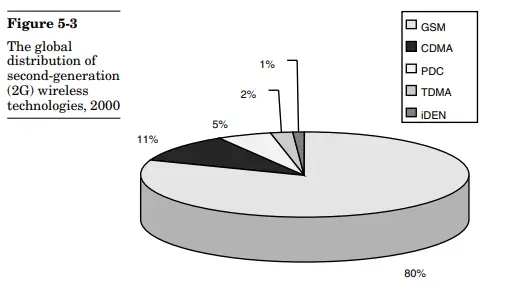
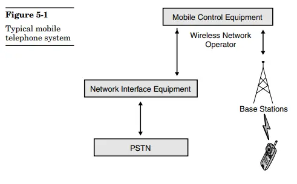
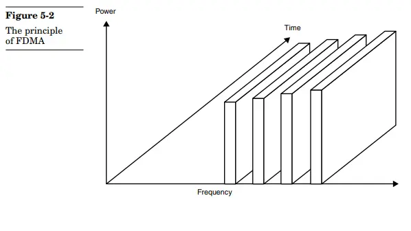
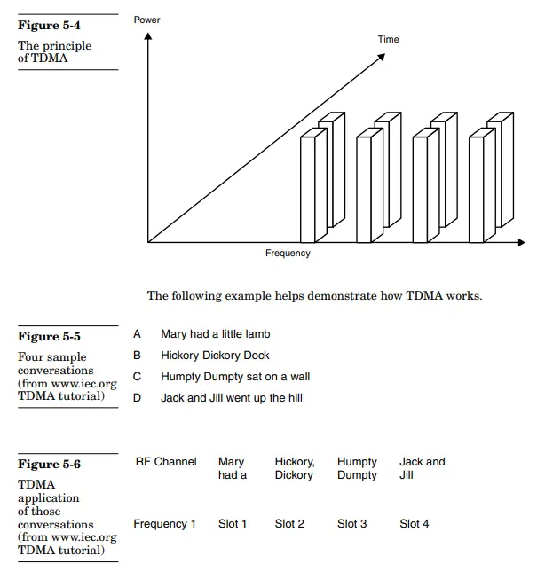
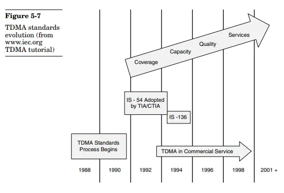
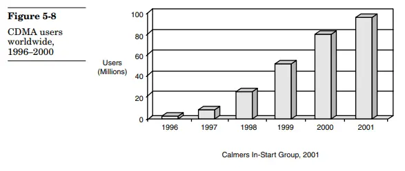
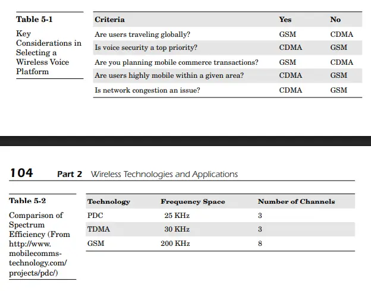

# Unit 3

## Wireless Technological Applications

!\[\[/Attachments of Obsidian Notes'/Unit3-1763903719379.webp]]

<figure><figcaption></figcaption></figure>

!\[\[/Attachments of Obsidian Notes'/Unit3-1763903696460.webp]]

<figure><figcaption></figcaption></figure>

## FDMA

Based on the sources, **Frequency Division Multiple Access (FDMA)** is one of the three primary methods developed for managing and allocating radio spectrum in cellular networks. !\[\[/Attachments of Obsidian Notes'/Unit3-1763903707330.webp]]

<figure><figcaption></figcaption></figure>

Here is a comprehensive overview of FDMA:

#### Definition and Function

* **FDMA** is a spectrum allocation method designed to provide access to a given frequency for multiple users (hence, multiple access).
* It is the **oldest frequency allocation method**.
* The premise of FDMA is **simple**: the available spectrum is divided into channels, and **each channel can be used for a single conversation**.
* This method is similar to standard wired phone systems, which allocate a single circuit for each conversation.
* FDMA enables conversations to **change channels** if the transmission weakens.
* It operates within a **narrow frequency range**.

#### Historical Context

* FDMA was first used on the initial analog **Advanced Mobile Phone System (AMPS) cellular systems** built in the United States in the late 1970s.
* It is often referred to as **Narrowband Analog Mobile Phone Service (NAMPS)**.
* As demand for AMPS systems increased, the limitations of FDMA became apparent.

#### Limitations and Drawbacks

FDMA has several significant limitations, which led to the development of successor technologies like TDMA and CDMA:

* **Inefficient Spectrum Use:** FDMA assigns channels even if no conversations are taking place, meaning it **does not efficiently use available spectrum**.
* **Limited Data Types:** It is **only capable of voice transmissions**; it cannot transmit data.
* **Outdated:** Due to these limitations, **few remaining FDMA implementations are in use today**.

#### Comparison to Successors

FDMA was one of the three major spectrum allocation methods that emerged as the wireless market matured in the 1980s and 1990s, alongside TDMA and CDMA. The rise of **TDMA** and **CDMA** was largely driven by the goal of achieving better spectrum management:

* **TDMA (Time Division Multiple Access)** provided significantly more cellular capacity than FDMA because it enabled multiple simultaneous conversations on a single channel, whereas FDMA required one channel per conversation. TDMA also supported multiple data types, including fax and data transmissions, which FDMA lacked.
* **CDMA (Code Division Multiple Access)** increased spectrum capacity eight to ten times more than an equivalent FDMA system.

***

**Analogy:** If managing radio spectrum is like managing lanes on a highway, **FDMA** is like dedicating an entire lane to a single car, even if that car is barely moving or is not currently in the lane. Because this is highly inefficient, **TDMA** (time slots) and **CDMA** (unique codes) were invented to allow many vehicles to share the same lane efficiently.

## TDMA

!\[\[/Attachments of Obsidian Notes'/Unit3-1763903744594.webp]]&#x20;

<figure><figcaption></figcaption></figure>

**Time Division Multiple Access (TDMA)** is one of the three primary spectrum allocation methods that emerged as the wireless market matured in the 1980s and 1990s, alongside Frequency Division Multiple Access (FDMA) and Code Division Multiple Access (CDMA).

TDMA quickly became a viable replacement for FDMA.

#### Functionality and Capacity

TDMA operates by digitizing the voice signal into a series of short packets. It utilizes a single-frequency channel for a very short time, and the receiving end reorganizes the packets to create the conversation.

This method provides **significantly more cellular capacity** than FDMA, as it enables multiple conversations to proceed on a single channel. Specifically, TDMA can capably divide an existing 30-KHz channel into three time slots, which allows for three simultaneous conversations and effectively triples the capacity in a given cell.

Benefits of TDMA over older FDMA include:

* **Digital Signal:** Because TDMA digitizes the signal, it provides better quality wireless calls than analog-based FDMA.
* **Multiple Data Types:** TDMA can easily handle various data types, including **voice, fax, and data transmissions**. This capability allows network operators to offer nonvoice services like Short Message Service (SMS) without making significant infrastructure changes.
* **Cost-Effective Upgrade:** The cost to upgrade from an FDMA network to TDMA was considered insignificant.

#### Standardization and Deployment

TDMA became the **dominant wireless network standard** in the 1980s, often referred to by its standard number, IS-54. It is categorized as a second-generation (2G) network standard.

* **GSM Foundation:** TDMA received a significant boost when the member nations of the **Global System for Mobile Communications (GSM)** selected TDMA as the basis for GSM networks.
* **Wide Deployment:** This adoption made TDMA the **most widely deployed wireless technology standard in terms of users** worldwide.

#### TDMA Pros and cons

In the ongoing debate between TDMA and CDMA architectures, the sources identify several key advantages and disadvantages for TDMA:

| TDMA Advantages                                                                                                                                                                                                                                                              | TDMA Disadvantages                                                                                                                                                                |
| ---------------------------------------------------------------------------------------------------------------------------------------------------------------------------------------------------------------------------------------------------------------------------- | --------------------------------------------------------------------------------------------------------------------------------------------------------------------------------- |
| **Longer Battery Life:** TDMA requires less transmitter power, leading to longer battery life for handsets.                                                                                                                                                                  | **Hard Roaming Handoffs:** When users travel between cell sites, TDMA relies on "hard handoffs". If all time slots in the next cell are allocated, users risk being disconnected. |
| **Less Expensive Infrastructure:** Its simplicity requires smaller and less expensive receivers and transmitters, making TDMA networks cheaper to build than CDMA networks.                                                                                                  | **Signal Distortion:** TDMA signals have a lower signal-to-noise ratio than CDMA, which can create the potential for more distorted signals.                                      |
| **Widest Deployment:** TDMA-based GSM networks were the most widely used wireless network technology, leading to rapid maturation of the technology.                                                                                                                         |                                                                                                                                                                                   |
| **International Roaming:** GSM’s global presence enables subscribers to use the same GSM handset around the world.                                                                                                                                                           |                                                                                                                                                                                   |
| **Data Security:** TDMA-based GSM networks use the **Subscriber Identity Module (SIM) card** architecture. The SIM card, a tamper-resistant smart card, is an ideal platform for mobile commerce because it provides **encryption and digital signatures** for transactions. |                                                                                                                                                                                   |

In comparison, CDMA offers three to five times more spectrum capacity than an equivalent TDMA system.

#### Related Technologies

* **PDC (Personal Digital Cellular):** This standard, deployed only in Japan, is based on TDMA.
* **iDEN (Integrated Dispatch Enhanced Network):** Used by Nextel in North America, iDEN combines traditional wireless voice (TDMA), dispatch radio, messaging, and data.
* **Multicarrier Environments:** TDMA, alongside CDMA and GSM, must be supported by corporate wireless applications when companies use multiple carriers across geographic operations. !\[\[/Attachments of Obsidian Notes'/Unit3-1763903804409.webp]]

<figure><figcaption></figcaption></figure>

## CDMA

**Code Division Multiple Access (CDMA)** is a major digital cellular technology and a primary spectrum allocation method used in cellular networks, categorized as a second-generation (2G) standard.

It became a widely adopted network technology following the older Frequency Division Multiple Access (FDMA) and alongside Time Division Multiple Access (TDMA). The underlying concept behind CDMA dates back to the 1940s. !\[\[/Attachments of Obsidian Notes'/Unit3-1763903828384.webp]]

<figure><figcaption></figcaption></figure>

#### Technical Function and Capacity

CDMA's mechanism for spectrum allocation is based on the concept of **spread spectrum technology**.

* **Operation:** Instead of dividing frequency by time or narrow frequency bands, CDMA adds a **unique code** onto each packet before transmission. The receiving end uses this same code to reconstruct the conversation.
* **Capacity:** CDMA offers **excellent capacity** by enabling different conversations to utilize the same frequency band simultaneously. It increases spectrum allocation capacity **three to five times more** than an equivalent TDMA system, and eight to ten times more than an equivalent FDMA system.
* **Security Basis:** Spread spectrum utilizes a **wider range of frequency** to send a signal, making the spread spectrum techniques more difficult to intercept than narrowband systems.

The CDMA standard, known as **IS-95**, was published in 1993, pioneered by Qualcomm Corporation. The first commercial CDMA network launched in Hong Kong in 1995. By 2000, the United States was the world’s largest CDMA market. The 3G standard for CDMA is **CDMA 2000**.

#### Advantages and Disadvantages (Compared to TDMA)

| CDMA Advantage                                                                                                                                                 | CDMA Disadvantage                                                                                                                               |
| -------------------------------------------------------------------------------------------------------------------------------------------------------------- | ----------------------------------------------------------------------------------------------------------------------------------------------- |
| **Strong voice security** due to direct spread frequency technique, making it very secure and harder to intercept or jam.                                      | **More expensive infrastructure and equipment** due to complexity.                                                                              |
| **Bandwidth efficiency**, offering significantly improved bandwidth allocation compared to TDMA.                                                               | **No international roaming** due to restricted geographic coverage.                                                                             |
| **Soft roaming handoffs**, where the handset polls various cells and switches to the one with the best signal, theoretically resulting in fewer dropped calls. | **No SIM card equivalent** to securely store cryptographic keys or confidential information, which hinders secure mobile commerce transactions. |
| Less distortion, leading to very clear communication quality.                                                                                                  | CDMA security algorithms (like CAVE) were privately designed, initially lacking widespread public analysis.                                     |

#### Security Architecture

CDMA networks function on a **symmetric key architecture**.

1. **A-Key:** CDMA handsets use a 64-bit symmetric key called the **A-Key** for authentication, which is programmed into the device. The A-Key is designed to stay local and is **never transmitted over the air**.
2. **CAVE Algorithm:** CDMA utilizes the **Cellular Authentication and Voice Encryption (CAVE)** algorithm for authentication and voice encryption.
3. **Shared Secret Data (SSD):** To minimize interception risk, CDMA networks derive a dynamic value called **Shared Secret Data (SSD)**, calculated by hashing the A-Key, the Electronic Serial Number (ESN) of the handset, and a random number using the CAVE algorithm.
4. **Authentication Process:** The authentication process is based on **challenge responses**. It involves the Mobile Switching Center (MSC) generating a random number (RANDU) that, when combined with SSD\_A (the authentication portion of SSD), ESN, and MIN (Mobile Identification Number) via CAVE, results in an 18-bit value called **AUTHU**. If the network's calculation of AUTHU matches the value transmitted by the phone, authentication is successful.
5. **Confidentiality:** For voice encryption, the handset uses the random number (RAND), SSD\_B (the encryption portion of SSD), ESN, and MIN with CAVE to create the Voice Privacy Mask (**VPMASK**).
6. **Vulnerabilities:** Cloning is possible, although it requires sophisticated techniques to crack a specific base station spreading code. Also, North American operators did not always utilize the voice encryption capabilities due to **U.S. government regulations** regarding encryption export and the belief in the technology's inherent security.

In the future, the CDMA community is migrating toward adopting publicly referenced security algorithms and introducing the **Removable User Identity Module (R-UIM)**, which is the equivalent of the GSM SIM card, to improve security and securely store cryptographic keys.

### Spread Spectrum

**Spread spectrum** is a fundamental communication technique in which wireless data is dispersed, or "spread," over a **wide bandwidth** of different frequencies.

#### Core Mechanism and Operation

The main objective of using spread spectrum is to fit more data into the existing available frequencies:

* **Wide Frequency Range** Spread spectrum utilizes a **wider range of frequency** to send a given signal compared to narrowband systems.
* **Coexistence** Spread spectrum signals appear to be **radio noise** to narrowband devices. This noise can be easily filtered out, allowing narrowband devices to coexist with spread spectrum systems.
* **CDMA Basis** Spread spectrum technology is the **underlying concept** behind **Code Division Multiple Access (CDMA)**. Although CDMA is not technically a spread spectrum technology, it is almost always used together with spread spectrum.

#### Security and Performance Benefits

Utilizing a wider frequency range provides two primary benefits: increased security and improved performance:

1. **Stronger Security (Confidentiality):** Spread spectrum techniques are **more secure** than narrowband systems. Direct spread spectrum technologies, like those utilized in CDMA, are more difficult to intercept because they use a wider spectrum range, which means a much greater range of frequencies must be evaluated. This also makes jamming a spread spectrum signal much harder than jamming narrowband systems.
2. **Increased Signal Quality:** Spreading the signal over a wider frequency range actually **increases signal quality and connections** because it reduces the risk of signals not getting through. In narrowband systems, high usage at a given frequency can prevent signals from being placed.

#### Primary Methods of Spreading

Two common spread spectrum methods are employed:

1. **Frequency Hopping Spread Spectrum (FHSS):** In FHSS systems, the transmitter and receiver hop from one frequency to another in **prearranged synchronized patterns**. The hops occur frequently, with very little time spent on any one frequency. This process reduces the possibility of interference with other devices and enables several overlapping FHSS systems to be operational at the same time. The underlying concept of frequency hopping dates back to the 1940s.
2. **Direct Sequence Spread Spectrum (DSSS):** DSSS pushes data through a **binary encoding process** that spreads the data by combining it with a **multibit pattern** or **pseudo-noise code**. This results in the original data being "inflated" and somewhat hidden; for instance, 1 bit of data might become 11 bits long. This encoding creates a tremendous amount of redundancy, making the data more resilient to air loss.

> To understand the concept, imagine a crowded room where many people are talking in pairs. If each pair speaks a unique language (a unique code) different from all the others, they can easily communicate and understand their partner amidst the overall noise because the interference between conversations is very low.

### FDMA TDMA CDMA

a comparison of the three major spectrum allocation methods used in cellular networks: **Frequency Division Multiple Access (FDMA), Time Division Multiple Access (TDMA), and Code Division Multiple Access (CDMA)**. These concepts are detailed in the sources, particularly within Chapter 5, "Introduction to Cellular Networks".

These three technologies all rely on the fundamental architecture where a geographic area is divided into cells, and spectrum must be shared and allocated so multiple users can place and receive calls simultaneously. Each method uses a different technique to divide the available radio frequency into usable chunks.

Here is a comprehensive comparison based on the sources:

### FDMA (Frequency Division Multiple Access)

**FDMA** is the **oldest frequency allocation method**.

| Characteristic          | Description                                                                                                                                                                                                |
| ----------------------- | ---------------------------------------------------------------------------------------------------------------------------------------------------------------------------------------------------------- |
| **Allocation Method**   | Divides the available spectrum into **channels**, with **each channel used for a single conversation**.                                                                                                    |
| **Capacity/Efficiency** | Does not efficiently use available spectrum because it assigns channels even if no conversations are taking place. Capacity is significantly lower compared to TDMA or CDMA.                               |
| **Signal Type**         | Primarily **analog** (e.g., used in AMPS systems), meaning the quality of calls is not as good as digital signals.                                                                                         |
| **Data Support**        | Only capable of **voice transmissions**; it cannot transmit data.                                                                                                                                          |
| **Deployment**          | First used on analog Advanced Mobile Phone System (AMPS) cellular systems in the late 1970s (also known as Narrowband Analog Mobile Phone Service, NAMPS). Few remaining implementations are in use today. |

### TDMA (Time Division Multiple Access)

**TDMA** quickly emerged as a **viable replacement** for FDMA.

| Characteristic            | Description                                                                                                                                                                                                                                                                                        |
| ------------------------- | -------------------------------------------------------------------------------------------------------------------------------------------------------------------------------------------------------------------------------------------------------------------------------------------------- |
| **Allocation Method**     | **Digitizes the voice signal** into short packets and divides a single-frequency channel into **time slots**. Multiple conversations proceed on a single channel by using different time slots. For example, a 30-KHz channel can be divided into three time slots, effectively tripling capacity. |
| **Capacity/Efficiency**   | Provides **significantly more cellular capacity** than FDMA. Capacity is generally **three to five times less** than an equivalent CDMA system.                                                                                                                                                    |
| **Signal Type**           | Digital signal provides **better quality wireless calls** than analog FDMA.                                                                                                                                                                                                                        |
| **Data Support**          | Easily handles various data types, including **voice, fax, and data transmissions** (e.g., SMS).                                                                                                                                                                                                   |
| **Deployment & Standard** | Became the dominant wireless network standard (IS-54) and was chosen as the basis for **Global System for Mobile Communications (GSM) networks**, making it the **most widely deployed technology standard in terms of users** worldwide.                                                          |
| **Handoffs**              | Uses **"hard handoffs,"** where users risk being disconnected if time slots in the next cell are already allocated.                                                                                                                                                                                |
| **Infrastructure/Cost**   | Simplicity requires smaller and **less expensive receivers and transmitters**, making TDMA networks cheaper to build than CDMA networks.                                                                                                                                                           |
| **Security Component**    | Utilizes the **Subscriber Identity Module (SIM) card** for key storage, authentication, encryption, and digital signatures, which is an ideal platform for mobile commerce transactions.                                                                                                           |
| **Roaming**               | **International roaming is easily achieved** due to the global presence of GSM.                                                                                                                                                                                                                    |

### CDMA (Code Division Multiple Access)

**CDMA** is based on the underlying concept of **spread spectrum technology**.

| Characteristic            | Description                                                                                                                                                                                                                         |
| ------------------------- | ----------------------------------------------------------------------------------------------------------------------------------------------------------------------------------------------------------------------------------- |
| **Allocation Method**     | Instead of dividing spectrum by time or frequency, CDMA **adds a unique code** onto each packet before transmission, allowing different conversations to utilize the **same frequency band** simultaneously.                        |
| **Capacity/Efficiency**   | Offers **excellent capacity**, increasing spectrum allocation **three to five times more** than an equivalent TDMA system, and eight to ten times more than an equivalent FDMA system.                                              |
| **Signal Type**           | Digital, offering an excellent signal-to-noise ratio, leading to **very clear communication quality**.                                                                                                                              |
| **Security Basis**        | Direct spread frequency technique makes it **very secure** and difficult to intercept or jam, especially compared to narrowband systems.                                                                                            |
| **Deployment & Standard** | Pioneered by Qualcomm, the standard (IS-95) launched commercially in the mid-1990s. CDMA technology was the fastest growing in terms of users by the early 2000s.                                                                   |
| **Handoffs**              | Uses **"soft handoffs,"** where the handset polls various cells and switches to the one with the best signal, theoretically leading to fewer dropped calls.                                                                         |
| **Infrastructure/Cost**   | Complexity means infrastructure and equipment are **more expensive** than TDMA networks.                                                                                                                                            |
| **Security Component**    | **Lacks a SIM card equivalent** to securely store cryptographic keys or confidential information (though R-UIM is being introduced). Uses the 64-bit symmetric **A-Key** for authentication, which is not transmitted over the air. |
| **Roaming**               | Cannot offer international roaming due to **restricted geographic coverage**.                                                                                                                                                       |

#### Summary Comparison Table (TDMA vs. CDMA)

The intense debate between TDMA and CDMA highlights their key differences:

| Feature                 | TDMA (GSM)                                                            | CDMA                                                            |
| ----------------------- | --------------------------------------------------------------------- | --------------------------------------------------------------- |
| **Spectrum Efficiency** | Good (triples FDMA capacity)                                          | Excellent (**3 to 5 times greater** than TDMA)                  |
| **Cost**                | Cheaper to build (less expensive infrastructure)                      | More expensive infrastructure and equipment                     |
| **Handoffs**            | Hard handoffs (risk of disconnection)                                 | Soft handoffs (fewer dropped calls)                             |
| **Security Storage**    | Uses **SIM card** (tamper-resistant for keys/commerce)                | Lacks SIM card equivalent (must store keys securely in handset) |
| **Roaming**             | **International roaming** easily achieved (due to GSM's global reach) | **No international roaming** (restricted geographic coverage)   |
| **Battery Life**        | Longer battery life                                                   | Shorter battery life                                            |

## Analogy in Dining Hall

| Technique | Separation Basis | Everyday Analogy                 | Key Feature                                  |
| --------- | ---------------- | -------------------------------- | -------------------------------------------- |
| **FDMA**  | Frequency        | Separate dining tables           | Parallel but separate channels               |
| **TDMA**  | Time             | Same table, different time slots | Time-sharing                                 |
| **CDMA**  | Code             | Same hall, different languages   | Code-based sharing & interference resistance |

Here’s a short, simple explanation of the analogy, &#x20;

**The Dining Hall:**

* **FDMA (Frequency Division):** Like people sitting at **different dining tables**, each group gets its own table (frequency). They can all talk **at the same time** without disturbing each other.
* **TDMA (Time Division):** Like people **sharing one table but booking at different times**. Everyone waits for their turn (time slot), so no one talks over someone else.
* **CDMA (Code Division):** Like many people in the **same hall speaking different languages**. Even though everyone talks at the same time and place, each listener understands only their chosen language (code), making the conversations separable.

Let me know if you want it even shorter or in one sentence!

!\[\[/Attachments of Obsidian Notes'/Unit3-1763903866560.webp]]

<figure><figcaption></figcaption></figure>

## PDC

**Personal Digital Cellular (PDC)** is a wireless network standard that is **deployed only in Japan**. Despite its limited geographic deployment, PDC ranked third globally in terms of subscribers, behind GSM and TDMA, due to the success of Japanese wireless operator NTT DoCoMo.

Here is a breakdown of PDC's characteristics, architecture, and importance:

#### Architecture and Functionality

* **Basis:** PDC's architecture is **based on TDMA (Time Division Multiple Access)** and operates in the **800-MHz and 1500-MHz bands**.
* **Efficiency:** PDC further divides the available radio spectrum, enabling **even greater cellular capacity** than traditional TDMA. This efficiency is a huge benefit in Japan's congested and mobile population.
* **Operation:** PDC systems can operate in either a full-transmission rate or a **half-transmission rate**. The half-rate allows for twice as many connections in a given frequency, though the drawback is slower throughput and a less clear signal due to a decreased signal-to-noise ratio.
* **Spectrum Efficiency Comparison:** PDC is more efficient than traditional TDMA or GSM.

| Technology | Frequency Space | Number of Channels |
| ---------- | --------------- | ------------------ |
| **PDC**    | 25 KHz          | 3                  |
| **TDMA**   | 30 KHz          | 3                  |
| **GSM**    | 200 KHz         | 8                  |

#### Packet Data and i-Mode

PDC systems handle data traffic very efficiently.

* **PDC Packet Data (PDC-P):** Japanese carrier NTT DoCoMo’s popular **i-mode service is based on PDC Packet Data (PDC-P)**.
* **Packet-Based:** Unlike other wireless data services in GSM that are circuit switched, PDC-P is **packet-based**, making it ideally suited for handling data transmissions.
* **Throughput:** PDC-P enables throughput approaching **28.8 Kbps**, which is considerably higher than the 14.4 Kbps maximum currently offered by GSM.

#### Advantages and Disadvantages

| PDC Advantages                                                                                                                         | PDC Disadvantages                                                                                      |
| -------------------------------------------------------------------------------------------------------------------------------------- | ------------------------------------------------------------------------------------------------------ |
| **Bandwidth Efficiency:** Offers superior bandwidth allocation over other TDMA technologies, approaching CDMA’s capacity capabilities. | **Limited Availability:** PDC is **only available in Japan**.                                          |
| **Packet Data (PDC-P):** Aligns nicely with the intermittent transfer of data.                                                         | **No Global Roaming:** PDC phones have no roaming capabilities outside of Japan.                       |
| **Easier Migration to 3G:** PDC-P provides a clear upgrade path and major evolutionary step toward Third-Generation (3G) networks.     | **No SIM Card:** Like CDMA, PDC does not use a tamper-resistant hardware module on the mobile handset. |

#### Future Outlook

PDC's importance in the overall wireless market is limited because the standard is **gradually being phased out in Japan**. As Japan aggressively moves toward 3G networks, the new networks will be based on technologies like Wideband CDMA (W-CDMA). PDC is considered a second-generation (2G) network standard.

## Security Threats

The section on Security Threats within Chapter 5, "Introduction to Cellular Networks," outlines the primary security goals for mobile networks and identifies the specific risks and weaknesses they must address.

#### Primary Security Goals

Cellular network operators must meet four fundamental security goals:

1. **Authentication:** Ensuring that **only valid users** are permitted to use the networks.
2. **Privacy:** Ensuring that **conversations cannot be listened to**.
3. **Data and voice integrity:** Ensuring that voice and data traffic cannot be read or compromised while in transit, and confirming the **validity of content** to ensure it has not been tampered with en route to the recipient. This requirement is critical for the development of **wireless transactions** where users might digitally sign an order form on the mobile handset.
4. **Performance:** Although not a security goal per se, security functions must be **highly scaleable** and must be processed in a manner that is **imperceptible to the user**.

#### Specific Security Risks and Threats

The three most significant security risks that cellular networks must contend with are:

**1. Fraud (Most Significant Risk)**

Fraud is cited as the **most significant security risk**, costing the industry over **$1 billion annually** by the late 1990s.

* **Handset Cloning:** This is the **most costly form of cellular fraud**. It occurs when hackers copy the **Electronic Serial Number (ESN)** of a valid handset and reprogram another handset with that same serial number.
  * **Vulnerability:** The ESN is transmitted during the initiation of each wireless call, making it susceptible to retrieval by hackers with sophisticated eavesdropping equipment, particularly if the transmission is not encrypted.
  * **Roaming Complication:** Detecting cloned handsets is difficult when hackers resell them in other regions due to the complexity of roaming relationships and potential latency.
  * **GSM Cloning:** Although GSM networks were initially thought immune due to the tamper-resistant Subscriber Identity Module (SIM) cards, cryptographers were able to crack GSM in the late 1990s. Furthermore, a simpler cloning method was discovered where a **phony base station** can communicate with a handset and instruct it to **turn off encryption**, retrieving crucial authentication information like the ESN in **clear text**.
  * **CDMA Cloning:** Cloning is also possible on CDMA networks, but it requires more sophisticated techniques to crack a specific **base station spreading code**. Hackers can sometimes obtain these codes by disassembling a standard CDMA phone and connecting it to a PC.
* **Physical Theft:** The physical theft of handsets is the most obvious form of fraud.
* **Fraudulent Sign-ups:** Users sign up for valid service using **false identification and billing information**.

**2. Network and Systems Availability**

Cellular networks are a vital component of any nation's communications infrastructure and must be capable of withstanding **denial of service (DoS) attacks**. These attacks could aim to bring the network down, either at a network-wide level or within an individual cell.

**3. Physical Protection**

Network operators must ensure that equipment is **protected, tamper resistant, and secure**. This is challenging because mobile base stations and equipment must be deployed remotely in **untrusted areas** across a variety of terrains and climates, unlike enterprise networks confined within physical buildings protected by firewalls.

***

_For combating these threats, network operators adopted measures such as encryption, maintaining blacklists of stolen phones (like the Central Equipment Identity Register or CEIR used by GSM carriers), implementing traffic analysis software to detect suspicious calling patterns, and supporting legislation to penalize cellular fraud_.

### Combating Fraud

Network operators have adopted several crucial measures to identify, prevent, and mitigate the risks associated with cellular fraud, which is cited as the **most significant security risk** in cellular networks.

The measures adopted for combating fraud include:

* **Encryption** Encryption can help **reduce fraud** because it makes the theft of Electronic Serial Numbers (ESNs) much more difficult. GSM networks, for example, minimize fraud by only transmitting the ESN during the phone’s initial use and relying on a **temporary ESN** for all subsequent calls.
* **Blacklists** Operators cooperate to track the ESNs of stolen phones. A central database enables network operators to **disable stolen cellular phones** on networks around the world.
* **Traffic Analysis** Operators utilize **sophisticated artificial intelligence software** to detect suspicious calling patterns. This software can look for a sudden increase in the length of calls or a sudden increase in the number of international calls. This helps operators track possible fraud and, if necessary, disable an individual handset.
* **Legislation** Many governments have enacted **strict legislation** that provides stiff penalties and fines for people involved in cellular fraud. In the United States, the **Cellular Telephone Protection Act** became law in April 1998, making it a crime to knowingly possess, use, or traffic in hardware or software configured to alter or modify a cellular phone without authorization.

#### Central Equipment Identity Register (CEIR)

To specifically combat fraud, the GSM member nations established a dedicated database located in Dublin, Ireland, known as the **Central Equipment Identity Register (CEIR)**.

The CEIR tracks all GSM handsets worldwide and maintains a list of known pirated or fraudulent handsets. It categorizes handsets into three lists:

1. **White list** Contains the International Mobile Equipment Identity (IMEI) ranges of all mobile phones approved to operate on the GSM network.
2. **Gray list** Contains the IMEIs of mobile phones that are **suspected lost or stolen**; these phones will still be able to place and receive calls, but network operators are notified on their usage.
3. **Black list** Contains the IMEIs of mobile phones that are **confirmed lost or stolen**; these mobiles are **not allowed to function on any GSM network**.

The complexity of roaming agreements and interconnection between carriers, coupled with a lack of real-time sharing of billing information, complicates efforts to immediately determine if a roaming user is valid. Handset cloning is noted as the **most costly form of cellular fraud**.

### General Security Principles

General Security Principles were adopted by wireless network operators and suppliers as mechanisms to avoid cloning problems and other security weaknesses.

#### I. Encryption as the Basic Mechanism

The most fundamental security mechanism adopted is **encryption**, which is the process of transforming plain-text voice or data into a format that cannot be understood if intercepted.

**Principle of Operation:** Encryption operates on the simple premise that an **encryption key is applied to a message** that creates an encrypted message. The receiving party then applies the same encryption key to decrypt and read the message in plain text.

#### II. The Principle of Key Strength

The relative strength of any encryption system is directly related to the **size of the encryption key**.

* **Key Size and Strength:** The **larger the key, the stronger the system**. This is because bigger keys mean there are theoretically more possible key combinations, making the successful discovery of a given key through exhaustive search (a brute force attempt) very time-consuming.
* **Hardware Limitation:** Longer key lengths pose a problem in wireless security because of the **limited hardware and processing power on the handsets**. For instance, initial digital networks like GSM relied on 64-bit keys, even though these keys have since been proven susceptible to recent brute force attacks.

#### III. Types of Encryption Systems

Encryption systems fall into two main categories: symmetric key systems and asymmetric key systems.

1. **Symmetric Key Systems**
   * Also known as **secret key, single key, or one-key systems**.
   * These systems function on the premise that the **encryption key and the decryption key are the same value, or symmetric**.
   * To secure communications, the sender and receiver must both possess the same key.
   * The **DES algorithm** is a well-known example of a symmetric key algorithm.
   * Symmetric algorithms can be further categorized as **block algorithms** (transforming blocks of data, often 64 bits or more in size) or **stream algorithms** (transforming individual bits of data).
2. **Asymmetric Key Systems**
   * Also known as **public/private key systems**.
   * These systems use **different or asymmetric keys** for encryption and decryption.
   * The key used for encryption can be made **public**, which significantly simplifies the key distribution process compared to symmetric systems.
   * The **RSA algorithm** is a well-known example of an asymmetric algorithm.

#### IV. Principle of Open Review

The integrity of a security system is highly dependent on whether its algorithms are open to public scrutiny:

* The relative strength of any security system rests on the ability of unaffiliated parties to **test and examine the systems for any theoretical weaknesses**.
* If cryptographic algorithms are kept **secret from public review**, it only **invites suspicion** and may result in the implementation of weaker cryptographic systems.
* This principle is particularly relevant to cellular security because numerous algorithms, such as the GSM algorithms (A3, A5, and A8), **were not subject to global peer review**.
